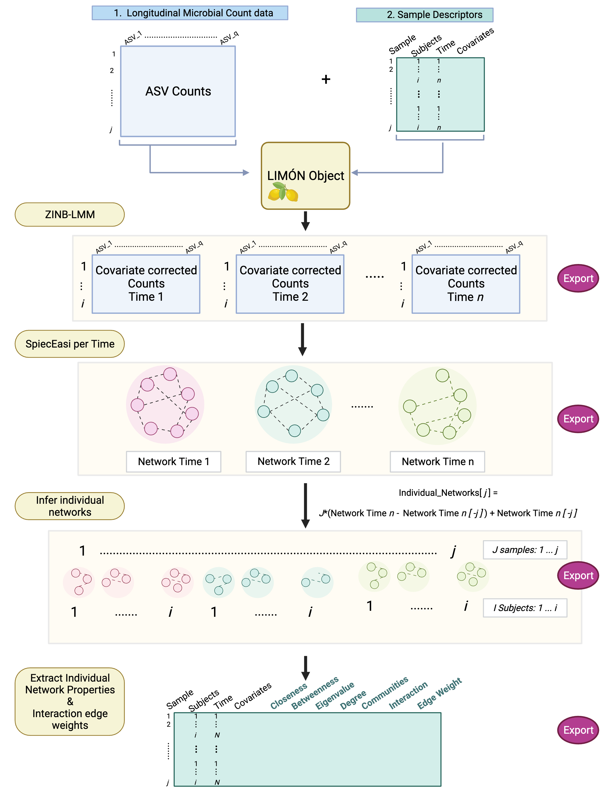

<!-- README.md is generated from README.Rmd. Please edit that file -->

```{r, include = FALSE}
knitr::opts_chunk$set(
  collapse = TRUE,
  comment = "#>",
  fig.path = "man/figures/README-",
  out.width = "100%"
)
```


<!-- README.md is generated from README.Rmd. Please edit that file -->

# LIMON
<!-- badges: start -->
<!-- badges: end -->
This pipeline is still under development. We appreciate any comments or feedback to help improve this platform

## Motivation
Microbial communities are dynamic structures that continually adapt to their surrounding environment. Such communities play pivotal roles in countless ecosystems from environmental to human health. Perturbations of these community structures have been affiliated with many disease processes such as Chron’s disease and cancer. Disturbances to existing ecosystems often occur over time making it essential to have robust methods for detecting longitudinal microbial interaction alterations as they develop. Existing methods for identifying temporal microbial communities' alterations has focused on abundance changes in individual taxa, leaving a crucial gap of how microbial interactions change overtime. Doing so would require novel statistical approaches to handle the complicated nature of compositional repeated count data. To address these shortcomings, we have developed a pipeline, LIMON – Longitudinal Individual Microbial Omics Networks. This novel statistical approach addresses six key challenges of modeling temporal and microbial data; (1) overdispersion, (2) zero-inflated count data, (3) compositionality, (4) sample covariates over time, (5) repeated measuring errors, and  (6) uniquely accounting for individual network characteristics by a selected feature of interest. In this model, temporal OTU count data is fitted to a zero-inflated negative binomial linear mixed model, undergoes centered-log ratio transformation and network inference with SPIEC-EASI, and finally estimation of individual network properties longitudinally using Linear Interpolation to Obtain Network Estimates for Single Samples (LIONNESS).  This approach allows users to remove the random effects of repeated samples and sample covariates, return networks per timepoint, identify interaction changes between each timepoint, and finally return individual networks and network characteristics per sample/timepoint. In doing so, LIMON provides a platform to identify the relationship between network centralities and sample features of interest overtime. In this preliminary work, we present our statistical approach and performance on a longitudinal infant microbiome dataset.  

## Work Flow


## Installation

You can install LIMON using devtools:

``` r
install.packages("devtools")
library(devtools)

install_github(“salverna/LIMON”)
```

## Tutorial

We are currently updating the package and will post a new tutorial in a few weeks. Thank


