<!-- README.md is generated from README.Rmd. Please edit that file -->
<!-- README.md is generated from README.Rmd. Please edit that file -->

# LIMON

<!-- badges: start -->
<!-- badges: end -->

This pipeline is still under development. We appreciate any comments or
feedback to help improve this platform

## Motivation

Microbial communities are dynamic structures that continually adapt to
their surrounding environment. Such communities play pivotal roles in
countless ecosystems from environmental to human health. Perturbations
of these community structures have been affiliated with many disease
processes such as Chron’s disease and cancer. Disturbances to existing
ecosystems often occur over time making it essential to have robust
methods for detecting longitudinal microbial interaction alterations as
they develop. Existing methods for identifying temporal microbial
communities’ alterations has focused on abundance changes in individual
taxa, leaving a crucial gap of how microbial interactions change
overtime. Doing so would require novel statistical approaches to handle
the complicated nature of compositional repeated count data. To address
these shortcomings, we have developed a pipeline, LIMON – Longitudinal
Individual Microbial Omics Networks. This novel statistical approach
addresses six key challenges of modeling temporal and microbial data;
(1) overdispersion, (2) zero-inflated count data, (3) compositionality,
(4) sample covariates over time, (5) repeated measuring errors, and (6)
uniquely accounting for individual network characteristics by a selected
feature of interest. In this model, temporal OTU count data is fitted to
a zero-inflated negative binomial linear mixed model, undergoes
centered-log ratio transformation and network inference with SPIEC-EASI,
and finally estimation of individual network properties longitudinally
using Linear Interpolation to Obtain Network Estimates for Single
Samples (LIONNESS). This approach allows users to remove the random
effects of repeated samples and sample covariates, return networks per
timepoint, identify interaction changes between each timepoint, and
finally return individual networks and network characteristics per
sample/timepoint. In doing so, LIMON provides a platform to identify the
relationship between network centralities and sample features of
interest overtime. In this preliminary work, we present our statistical
approach and performance on a longitudinal infant microbiome dataset.

## Work Flow

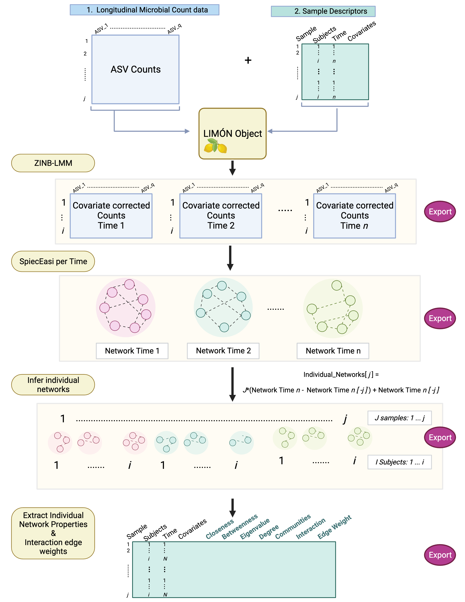

## Installation

You can install LIMON using devtools:

``` r
install.packages("devtools")
library(devtools)

install_github(“salverna/LIMON”)
```

## Tutorial

The following is an example implementation of running LIMON using data
from Olm et al 2019 study on the gut microbiota of infants who developed
[necrotizing enterocolitis](https://pubmed.ncbi.nlm.nih.gov/31844663/).
This was a NICU study that conducted deep metagenomic profiling of
samples collected longitudinally from 150 pre-term infants. 30 of these
infants developed necrotizing enterocolitis. For this example data, we
used the
[MicrobiomeDB](https://microbiomedb.org/mbio/app/workspace/analyses/DS_84fcb69f4e/new)
to pull the genus level relative abundance metagenomic tables.

<br> General tips for using LIMON;

- Filter your taxa table down (Ex: 25-100 ASVs.
- Ensure the row names of your Count table and Sample Data table are the
  same
- Have an integer-based “Time” column in your Sample Data where Time
  point = 1, Time point 2 = 2, etc.
- Perform linear mixed model selection as outlined in
  [NBZIMM](https://github.com/nyiuab/NBZIMM) to identify the appropriate
  covariates and correlation structure for the zero-inflated negative
  binomial linear mixed model
- Remove samples with NAs in covariates or perform missing data
  imputation
- Know if your count table is raw counts or proportion-based data (i.e.,
  relative abundance transformed)
- Test out optimal SPIEC-EASI parameters on a subset of samples before
  implementing the full pipeline
- Use the same parameters for SPIEC-EASI per time as for individual
  networks

### 1. Data Prep

<br> Load the LIMON package and additional libraries

``` r
# For LIMON
library(LIMON)
library(here)
library(tidyverse)
library(igraph)
library(NBZIMM)
library(SpiecEasi)

# For Statistical Testing
library(lme4)
library(lmerTest)
```

#### 1.1 DATA CLEANING

------------------------------------------------------------------------

Prior to running the pipeline, we want to have nicely formatted data. So
buckle up for some data cleaning steps before we get to the fun part.
<br>

**Metadata**  
Load the raw Data for all infants

``` r
data("NEC_Participant_data")
data("NEC_Repeated_data")
data("NEC_Sample_data")
#data("NEC_Metagenomic_data")
NEC_Metagenomic_data <- read_delim(here("NICUNEC-1_Metagenomic sequencing assay_subsettedData.txt"))
```

Merge the sample/participant dataframes together. In this dataset,
Particiapnt ID represents each unique infant, while Sample ID represents
each unique metagenomic sample (ie the repeated measure from infants)

``` r
Meta_merged_raw <- merge(NEC_Participant_data, NEC_Repeated_data, by = "Participant_ID")

Meta_merged_raw2 <- merge(Meta_merged_raw, NEC_Sample_data, 
                         by = c("Participant_repeated_measure_ID", "Participant_ID"))

Meta_merged_raw2 <- column_to_rownames(Meta_merged_raw2, "Sample_ID")

# Remove blank space and extra characters from Participant ID
Meta_merged_raw2$Participant_ID <- sub(" .*", "", Meta_merged_raw2$Participant_ID)
```

Use the Age (days) and the time since NEC column to make an Age at
diagnosis variable

``` r
#Make new column with diagnosis age
Meta_merged_raw2$Diagnosis_Age <- Meta_merged_raw2$Age..days...OBI_0001169. - 
                                  Meta_merged_raw2$Days.of.period.NEC.diagnosed..days...EUPATH_0009213.

# Fill down the Diagnosis_Age
Meta_merged_raw3 <- Meta_merged_raw2 %>%
  group_by(Participant_ID) %>%
  fill(Diagnosis_Age)

# Make a Binary NEC column with 0's for NEC no and 1's for NEC yes
Meta_merged_raw3$NEC <- NULL

Meta_merged_raw4 <- Meta_merged_raw3 %>% 
  mutate(NEC = case_when(
    !is.na(Diagnosis_Age) ~ 1,
    is.na(Diagnosis_Age) ~ 0,
    TRUE ~ NA_real_ 
  ))


# Filter down to columns of interest
Meta_merged_raw5 <- Meta_merged_raw4[,c(2,5,7,8,16,26,48,49)]

names(Meta_merged_raw5) <- c("Subject_ID", "Birth_weight", "Sex", "Diet", "Birth_mode", "Age", "Diagnosis_Age", "NEC")
rownames(Meta_merged_raw5) <- rownames(Meta_merged_raw2)
Meta_merged_raw5 <- rownames_to_column(Meta_merged_raw5, "SampleID")
```

Filter to NEC infants & create time variable based on age. This will be
the sample data we will use when running the pipeline for NEC infants.
The time variable we used is an every 10 day sample during the first 30
days of life (Time 1 = 10-12 days old, Time 2 = 18-22 days old, Time 3 =
28 -32 years old). We also filter by infants who were diagnosed within
the first 35 days of life to pick up on network changes during this
period.

``` r
NEC_Meta_raw <- Meta_merged_raw5 %>% filter(NEC == 1)
NEC_Meta_raw2 <- NEC_Meta_raw %>% filter(Diagnosis_Age <=35)
NEC_Meta_raw2$Time <- NULL

NEC_Meta_data <- NEC_Meta_raw2 %>% mutate(Time = case_when(
  Age >= 8 & Age <= 12 ~ 1,
  Age >= 18 & Age <= 22 ~ 2,
  Age >= 28 & Age <= 32 ~ 3,
  TRUE ~ NA )) %>%
  filter(!is.na(Time))

NEC_Meta_data1 <- NEC_Meta_data[!duplicated(NEC_Meta_data[c("Subject_ID", "Time")]), ]

#print how many participants we have
length(unique(NEC_Meta_data1$Subject_ID))
NEC_Meta_data <- column_to_rownames(NEC_Meta_data1, "SampleID")
```

Now repeat for non-NEC infants (we will label as “HC” for healthy
control)

``` r
HC_Meta_raw <- Meta_merged_raw5 %>% filter(NEC == 0)
HC_Meta_raw$Time <- NULL

HC_Meta_data <- HC_Meta_raw %>% mutate(Time = case_when(
  Age >= 8 & Age <= 12 ~ 1,
  Age >= 18 & Age <= 22 ~ 2,
  Age >= 28 & Age <= 32 ~ 3,
  TRUE ~ NA )) %>%
  filter(!is.na(Time))

HC_Meta_data <- HC_Meta_data[!duplicated(HC_Meta_data[c("Subject_ID", "Time")]), ]

length(unique(HC_Meta_data$Subject_ID))


HC_Meta_data <- column_to_rownames(HC_Meta_data, "SampleID")
```

<br>

**Count Data**  
Now lets do a similar process for the count data.

``` r
# Step 1 - Read Rawcounts
###################################################################
#drop the sample data and then the Phylum columns
Counts <- NEC_Metagenomic_data[,-c(1,3,4)]
Counts <- column_to_rownames(Counts, "Sample_ID")

# Step 2 - Clean & Filter the table 
###################################################################
Counts[is.na(Counts)] <- 0 #convert NAs to 0

colnames(Counts) <- sub(" .*", "", colnames(Counts))
```

Filter to non-NEC infants & and then the top 35 most abundant taxa

``` r
# Filter to non-NEC
HC_Counts <- Counts %>% 
  subset(rownames(Counts) %in% rownames(HC_Meta_data))

# Filter to top 35 most abundant taxa
col_sums <- colSums(HC_Counts)
colsums_sorted <- order(col_sums, decreasing = TRUE)
colsums_sorted <- colsums_sorted[1:35]
HC_Counts <- HC_Counts[, colsums_sorted]
```

Filter to NEC infants & and then the top 35 most abundant taxa

``` r
# Filter to non-NEC
NEC_Counts <- Counts %>% 
  subset(rownames(Counts) %in% rownames(NEC_Meta_data))


# Filter to top 35 most abundant taxa
col_sums <- colSums(NEC_Counts)
colsums_sorted <- order(col_sums, decreasing = TRUE)
colsums_sorted <- colsums_sorted[1:35]
NEC_Counts <- NEC_Counts[, colsums_sorted]

#Filter Metadata by number of counts 
NEC_Meta_data <- NEC_Meta_data %>% subset(rownames(NEC_Meta_data) %in% rownames(NEC_Counts))
```

<br> Woo! Now we have two clean count tables and two clean sample data
tables. Lets move on to implementing the LIMON Analysis <br>

### 2. NON-NEC INFANT ANALYSIS

------------------------------------------------------------------------

#### 2.1 Make the LIMON Object

``` r
# Make the Object
HC_obj <- LIMON_Obj(Counts = HC_Counts, 
                           SampleData = HC_Meta_data)
```

#### 2.2 Fit the distribution/remove covariates

Note we will set “prop.data” = TRUE as these counts are in terms of
proportions (relative abundance), but other options are to speciy
ZINBLMM or NBLMM (see documentation). The counts will be corrected by
infant diet (breast milk vs formula), birth mode (cesarean vs vaginal)
and birth weight (grams).

``` r
HC_obj2 <- LIMON_DistrFit(Obj = HC_obj, 
                           prop.data = TRUE,
                           Time = "Time", 
                           Subject = "Subject_ID", 
                           Covariates = c("Diet", "Birth_mode", "Birth_weight"),
                           model = "Diet+Birth_mode+Birth_weight")
```

The output from this function are lists of the cleaned counts per time
point stored in the output object.

#### 2.3 Network inference per time (SPIEC-EASI)

The LIMON_NetINf_Time() function will fit a spiec-easi network per time
point and accepts the same parameters as spiec.easi(). For information
on choosing the appropriate SPIEC EASI parameters, please see their
[documentation](https://github.com/zdk123/SpiecEasi). For this example
we used “bstars” as the selection criteria.

``` r
# Set seed for reproducability
pseed <- list(rep.num=50, seed=10010)

# infer network for each timepoint
HC_obj3 <- LIMON_NetInf_Time(Obj = HC_obj2, 
                                         method = "glasso", 
                                         sel.criterion = "bstars",
                                         lambda.min.ratio = 0.01,
                                         pulsar.select=TRUE, 
                                         pulsar.params=pseed,
                                         nlambda = 5)
```

The outputs from this function are SpiecEasi networks per time point
stored in the object. To check network stability, use the getStability()
function to see if it is greater than 0.05

``` r
# Check Network stability is greater than 0.05 for each timepoint
getStability(HC_obj3[["SpiecEasi_Time"]][["Net_1"]])
getStability(HC_obj3[["SpiecEasi_Time"]][["Net_2"]])
getStability(HC_obj3[["SpiecEasi_Time"]][["Net_3"]])
```

#### 2.4 Get the Edge Tables and Print Networks

Users have the option to specify the absolute edge value to filter by.
We chose 0.2.

``` r
# Print Networks
HC_obj4 <- LIMON_Edges_Networks(HC_obj3, threshold = 0.2, vertex.size = 3, 
                                       vertex.label.cex = 8, vertex.label.color = "black")
```

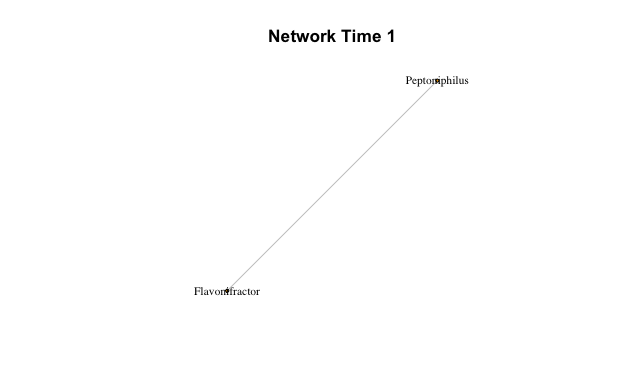  
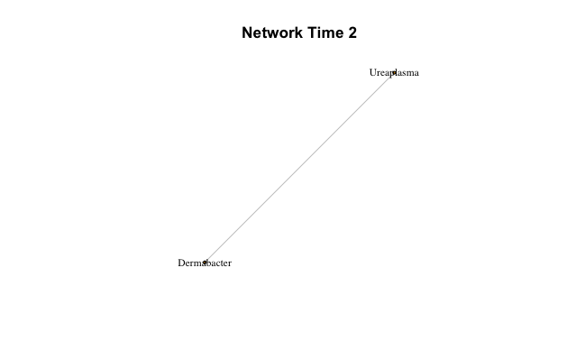  
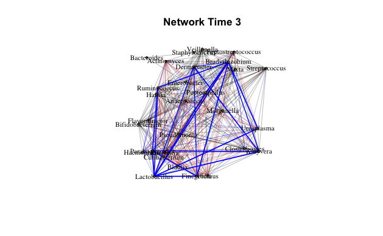

``` r
# Differences by visit
HC_obj5 <- LIMON_Diff_Networks(HC_obj4, threshold = 0.2, vertex.size = 3, 
                                       vertex.label.cex = 8, vertex.label.color = "black")
```

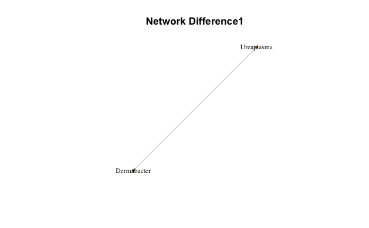  
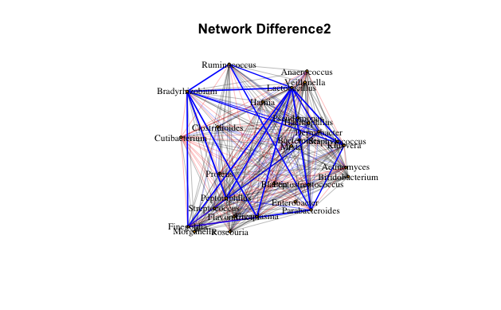  
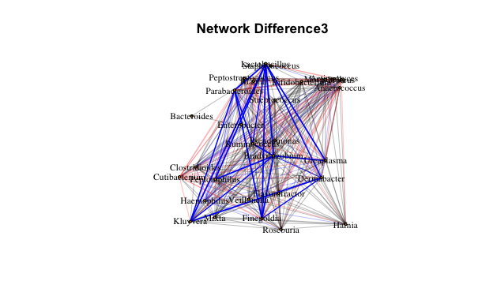

To get the edge tables, the LIMON_Cyto_Export function will write the
edge table for each Time point to the global environment as
“Edge_Table\_#”. The columns are “Source”, “Sink” and “Edge” for edge
weight. Rename each edge table to match the condition. The exported csv
files will be useful for building visualization in Cytoscape.

``` r
# Export
LIMON_Cyto_Export(HC_obj4)

# Rename each exported edge table
HC_T1_edge <- Edge_Table_1
HC_T2_edge <- Edge_Table_2
HC_T3_edge <- Edge_Table_3

# Write each to CSV
write.csv(HC_T1_edge, here("Output", "Edge Tables", "HC_T1_edge.csv"))
write.csv(HC_T2_edge, here("Output", "Edge Tables", "HC_T2_edge.csv"))
write.csv(HC_T3_edge, here("Output", "Edge Tables", "HC_T3_edge.csv"))
```

#### 2.5 Individual Networks

Note this will take awhile to run depending on how many samples/taxa you
are running. This inference was based off of
[lionessR](https://github.com/mararie/lionessR) approach for single
sample network inference. Here we iteratively remove one sample at a
time and re-infer that network minus one sample. The resulting network
is then subtracted from the overall network for that timepoint and
normalized by that samples importance. For J samples and N time points,
inferring the network for the jth sample can be found by $$
Individual Network_j = J*(Network_Time_n - Network_Time_n[-j]) + Network_Time_n[-j]
$$

Using the same criteria as above, we can now estimate the individual
networks.

``` r
# individual Networks
HC_obj6 <- LIMON_IndNet(Obj = HC_obj5, method = "glasso", 
                                         sel.criterion = "bstars",
                                         lambda.min.ratio = 0.01,
                                         pulsar.params=pseed,
                                         nlambda = 5)
```

#### 2.6 Edge and Centrality estimation

Finally, we can extract the taxa-taxa edges and network centralitiy
measures from the individually inferred graphs. These measures are
inferred from the [igraph](https://r.igraph.org/) package. Current
centralities that will be returned are average Degree per node, average
closeness, average betweenness, eigenvector for the network, and number
of communities. These are added to the SampleData list stored in the
LIMON object and then written to the global environment as “SampleData”.
Next we can pull each interaction (taxon-taxon connection) along with
its corresponding edge weight. This is added to the a different
data.frame.

``` r
HC_obj7 <- LIMON_IndEdges(HC_obj6, threshold = 0.2)
HC_obj8 <- LIMON_Centralities(HC_obj7)
```

#### 2.7 Cleaning up and saving the outputs

``` r
# Rename Sample Data with centralities added
HC_Sample_dataf <- LIMON_SampleData

# Save to Output
write.csv(HC_Sample_dataf, here("Output", "HC_Centralities.csv"))

# Save the final LIMON Object
saveRDS(HC_obj8, here("Output", "HC_LIMON.rds"))
```

<br> Now lets repeat this for the NEC data <br>

### 3. NEC INFANT ANALYSIS

------------------------------------------------------------------------

#### 3.1 Make the LIMON Object

``` r
# Make the Object
NEC_obj <- LIMON_Obj(Counts = NEC_Counts, 
                           SampleData = NEC_Meta_data)
```

#### 3.2 Fit the distribution/remove covariates

Repeat the fit with the same covariates as in the healthy controls

``` r
# Fit the distribution/remove covariates
NEC_Obj2 <- LIMON_DistrFit(Obj = NEC_obj, 
                           prop.data = TRUE,
                                       Time = "Time", 
                                       Subject = "Subject_ID", 
                                       Covariates = c("Diet", "Birth_mode", "Birth_weight"),
                                       model = "Diet+Birth_mode+Birth_weight")
```

#### 3.3 SPIEC-EASI per time

Using the same parameters as above,

``` r
# Set seed
pseed <- list(rep.num=50, seed=10010)

# SPIEC-EASI per time
NEC_Obj3 <- LIMON_NetInf_Time(Obj = NEC_Obj2, 
                                         method = "glasso", 
                                         sel.criterion = "bstars",
                                         lambda.min.ratio = 0.01,
                                         pulsar.select=TRUE, 
                                         pulsar.params=pseed,
                                         nlambda = 5)
```

#### 3.4 Get the Edge Tables and Print Networks

Users have the option to specify the absolute edge value to filter by.
We chose 0.2.

``` r
# Print Networks
NEC_Obj4 <- LIMON_Edges_Networks(NEC_Obj3, threshold = 0.2, vertex.size = 3, 
                                       vertex.label.cex = 8, vertex.label.color = "black")
```

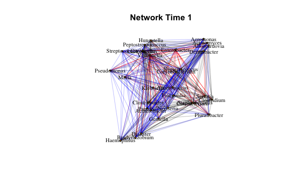  
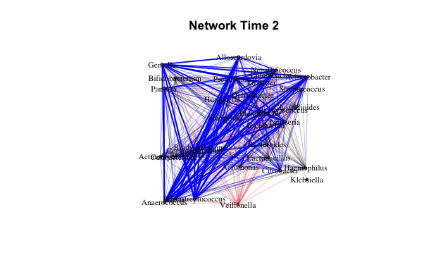  
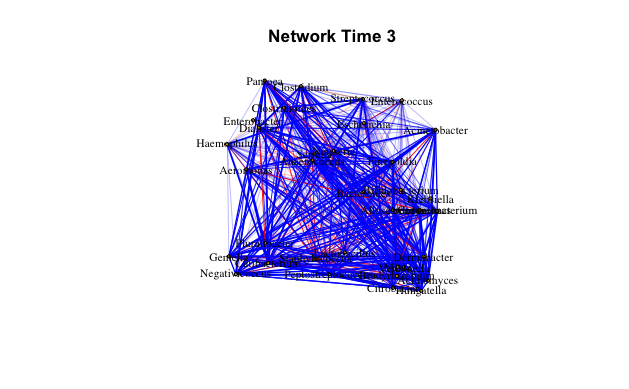

``` r
# Differences by visit
NEC_Obj5 <- LIMON_Diff_Networks(NEC_Obj4, threshold = 0.2, vertex.size = 3, 
                                       vertex.label.cex = 8, vertex.label.color = "black")
```

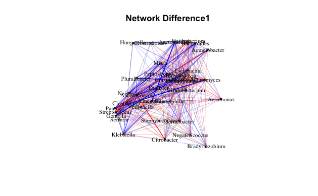  
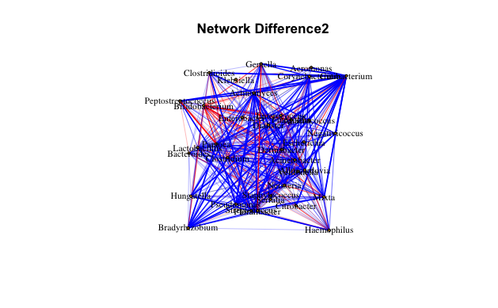  
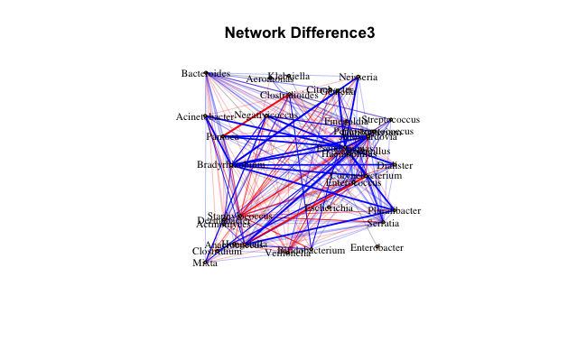

Get the edge tables

``` r
LIMON_Cyto_Export(NEC_Obj5)
NEC_T1_edge <- Edge_Table_1
NEC_T2_edge <- Edge_Table_2
NEC_T3_edge <- Edge_Table_3
```

#### 3.5 Individual Networks

Using the same criteria as above, we can now estimate the individual
networks.

``` r
# Individual Networks
NEC_Obj6 <- LIMON_IndNet(Obj = NEC_Obj5, 
                               method = "glasso", 
                                         sel.criterion = "bstars",
                                         lambda.min.ratio = 0.01,
                                         pulsar.select=TRUE, 
                                         pulsar.params=pseed,
                                         nlambda = 5)
```

#### 3.6 Edge and Centrality estimation

``` r
NEC_Obj7 <- LIMON_IndEdges(NEC_Obj6, threshold = 0.2)

NEC_Obj8 <- LIMON_Centralities(NEC_Obj7)
```

#### 3.7 Cleaning up and saving the outputs

``` r
# Rename Sample Data with centralities added
NC_Sample_dataf <- LIMON_SampleData

# Save to Output
write.csv(NC_Sample_dataf, here("Output", "NC_Centralities.csv"))

# Save the final LIMON Object
saveRDS(NEC_Obj8, here("Output", "NEC_LIMON.rds"))
```

<br>

### 4. Saving & Reading LIMON Data Objects

To avoid having to repeat the individual network inference step
everytime a usre wants to close their code, we rcommend using the
[saveRDS()](https://rdrr.io/r/base/readRDS.html) function to save the
LIMON output to your directory. In this example we use the
[here](https://here.r-lib.org/) package to save it to an Output folder.

``` r
# Save the Object to an Output folder with the previous code
# saveRDS(NEC_Obj8, here("Output", "NEC_LIMON.rds"))
```

Read the object back in with

``` r
NEC_LIMON <- readRDS(here("Output", "NEC_LIMON.rds"))

HC_LIMON <- readRDS(here("Output", "HC_LIMON.rds"))
```

<br>

### 5. Filtering LIMON Objects

Lets say we wanted to infer networks for males and female neonates who
developed NEC seperately. To do so, seperate out the LIMON objects as
below and proceed with the same workflow as above.

``` r
# Split into Males and Females

# NEC Male Neonates
###########################################################################
#Filter the metadata
mInfant <- NEC_LIMON
mInfant[["SampleData"]] <- mInfant[["SampleData"]] %>% filter(Sex == "Male")

#Filter the Countdata
mInfant[["Counts"]] <- mInfant[["Counts"]] %>% filter(rownames(mInfant[["Counts"]]) %in% rownames(mInfant[["SampleData"]]))


# NEC Female Neonates
###########################################################################
#Filter the metadata
fInfant <- NEC_LIMON 
fInfant[["SampleData"]] <- fInfant[["SampleData"]] %>% filter(Sex == "Female")

#Filter the Countdata
fInfant[["Counts"]] <- fInfant[["Counts"]] %>% filter(rownames(fInfant[["Counts"]]) %in% rownames(fInfant[["SampleData"]]))
```

<br>

### 6. Statistical Analysis of LIMON outputs

Now that we have inferred longitudinal individual network changes, what
do we do with this information? The first thing we can do is examine how
centrality measures change overtime. An example of what some of this
centralities measures are is below,

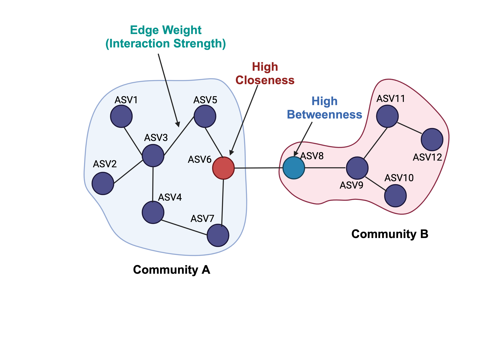

<br> Assume we are starting from the point where we read our saved LIMON
objects back into R using readRDS.

#### 6.1 Grouping the Model Data

We are interested in looking at differences in network characteristics
overtime between the NEC and nonNEC infants. Lets start by groupin their
SampleData outputs from LIMON with the centrality measures

``` r
# Group the data 
Centrality_data <- rbind(NEC_LIMON[["SampleData"]], HC_LIMON[["SampleData"]])

# Update the disease column with character values for better graph printings
Centrality_data <- Centrality_data %>% mutate(NEC = case_when(NEC == 0 ~ "Non-NEC",
                                                              NEC == 1 ~ "NEC"))
```

#### 6.2 Network Degree differences

The first centrality we will examine is Degree. To do so, lets fit a
linear mixed model looking at the interaction between Time and the
disease state. Then we will plot the original values with the fitted
line side by side for NEC and Non-NEC infants.

``` r
# Fit the linear mixed model 
model <- lmer(DegreeCentrality ~ Time * NEC + (1 | Subject_ID), data = Centrality_data)

# Print the results 
sjPlot::tab_model(model)
summary_model <- summary(model)

# Extract the p-value for the interaction term
p_value_interaction <- summary_model$coefficients["Time:NECNon-NEC","Pr(>|t|)"]

# Extract fixed effects from the model
fixed_effects <- fixef(model)

# Create a data frame for plotting
plot_data <- expand.grid(Time = unique(Centrality_data$Time), 
                         NEC = unique(Centrality_data$NEC),
                         Subject_ID = unique(Centrality_data$Subject_ID))

# Add the fixed effects to the data frame
plot_data$DegreeCentrality <- predict(model, newdata = plot_data)

# Plot the interaction effect over time with original values
ggplot() +
  geom_line(data = plot_data, aes(x = Time, y = DegreeCentrality, group = Subject_ID), 
            linetype = "dashed", color = "gray") +
  geom_jitter(data = Centrality_data, aes(x = Time, y = DegreeCentrality, color = NEC)) +
  facet_wrap(~NEC) +
  labs(title = paste("NEC Group Differences Over Time\n", 
                     "Interaction p-value =", 
                     format(p_value_interaction, scientific = FALSE, digits = 2)),
       x = "Time",
       y = "Degree Centrality") +
  theme_minimal() + 
  scale_x_continuous(breaks = c(1, 2, 3), labels = c("8-12 Days", "18-22 Days", "28-32"))
```

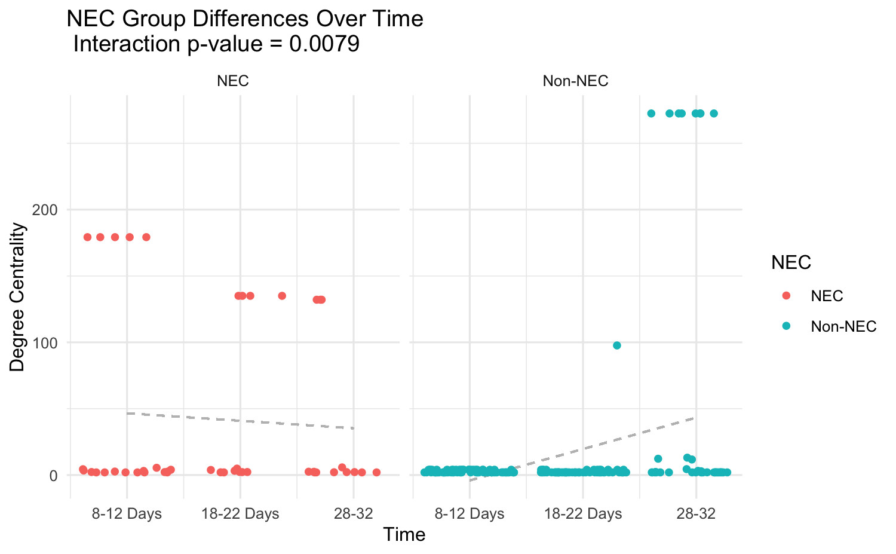

#### 6.3 Network Betweenness differences

We can repeat the same code for a different measure like betweenness

``` r
# Fit the model
model <- lmer(BetweennessCentrality ~ Time * NEC + (1 | Subject_ID), data = Centrality_data)
sjPlot::tab_model(model)
summary_model <- summary(model)

# Extract the p-value for the interaction term
p_value_interaction <- summary_model$coefficients["Time:NECNon-NEC","Pr(>|t|)"]

# Extract fixed effects from the model
fixed_effects <- fixef(model)

# Create a data frame for plotting
plot_data <- expand.grid(Time = unique(Centrality_data$Time), 
                         NEC = unique(Centrality_data$NEC),
                         Subject_ID = unique(Centrality_data$Subject_ID))

# Add the fixed effects to the data frame
plot_data$BetweennessCentrality <- predict(model, newdata = plot_data)

# Plot the interaction effect over time with original values
ggplot() +
  geom_line(data = plot_data, aes(x = Time, y = BetweennessCentrality, group = Subject_ID), linetype = "dashed", color = "gray") +
  geom_jitter(data = Centrality_data, aes(x = Time, y = BetweennessCentrality, color = NEC)) +
  facet_wrap(~NEC) +
  labs(title = paste("NEC Group Differences Over Time\n", 
                     "Interaction p-value =", 
                     format(p_value_interaction, scientific = FALSE, digits = 2)),
       x = "Time",
       y = "Betweenness Centrality") +
  theme_minimal() + 
  scale_x_continuous(breaks = c(1, 2, 3), labels = c("8-12 Days", "18-22 Days", "28-32"))
```

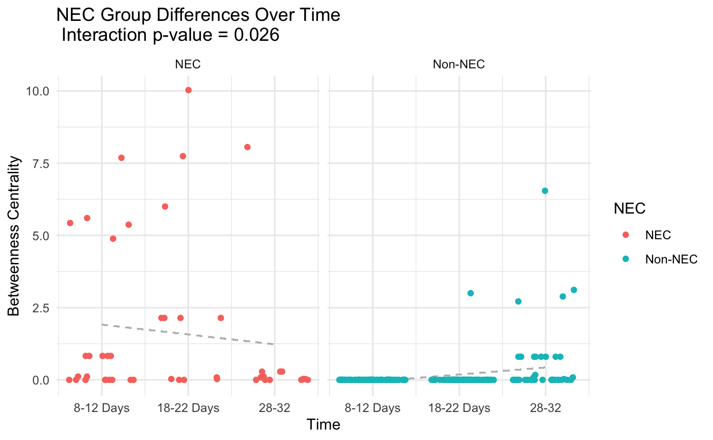 <br>

Further investigation can be to examine changes in the edges between two
taxa overtime between the two groups. We will update this tutorial with
this appraoch as we continue to refine LIMON. <br>

Thanks for following along! If you have any suggestions, comments or
questions, please reach out so we can make this line of investigation as
robust as possible :)
